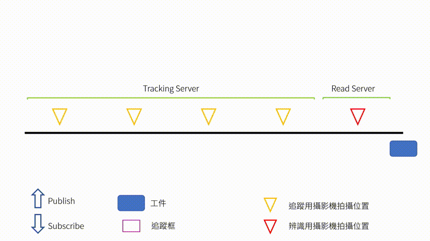

# 料件追蹤與標籤辨識
1092_物聯網與大數據於智慧製造應用 第2組 期末專案

## 目標
我們的目標為對輸送帶上的工件進行追蹤，以取得其在輸送帶上的即時位置，幫助了解產線狀況；另外我們也提供使用者透過瀏覽器連接並即時查看這些影像。

## 說明
### 系統架構圖
下圖顯示出我們這套系統內部的分工，以及透過那些傳輸協議可以連接這些系統

### 模擬動畫

## 子程式說明
- [QRcode 讀取](/QRcode_reader)
- [物件追蹤](/ItemTracking)
- [影像傳遞伺服器](/VideoStreaming_Server)

## 已知問題
